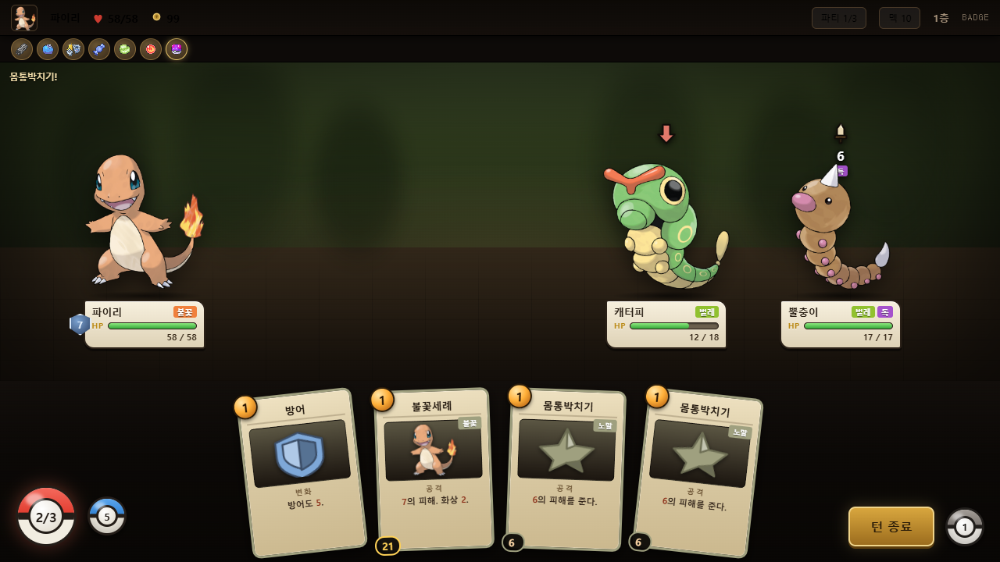
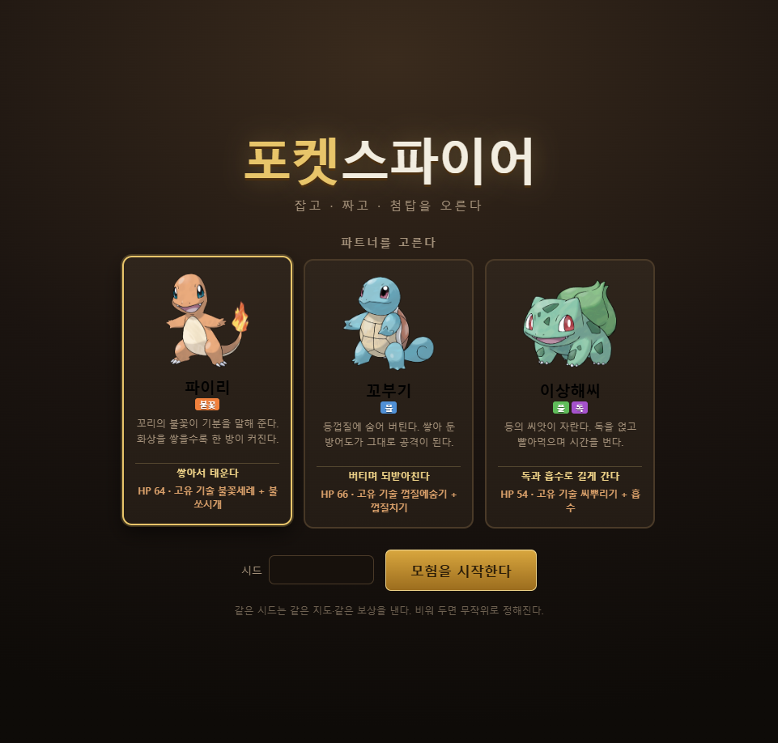
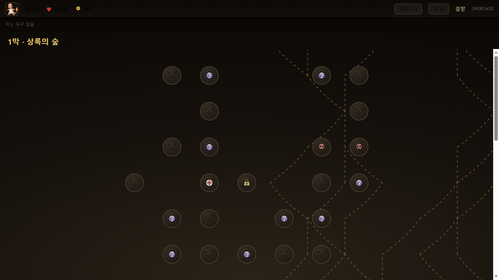
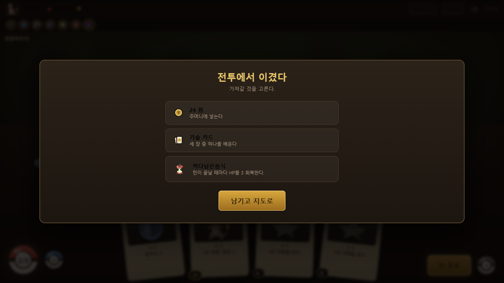
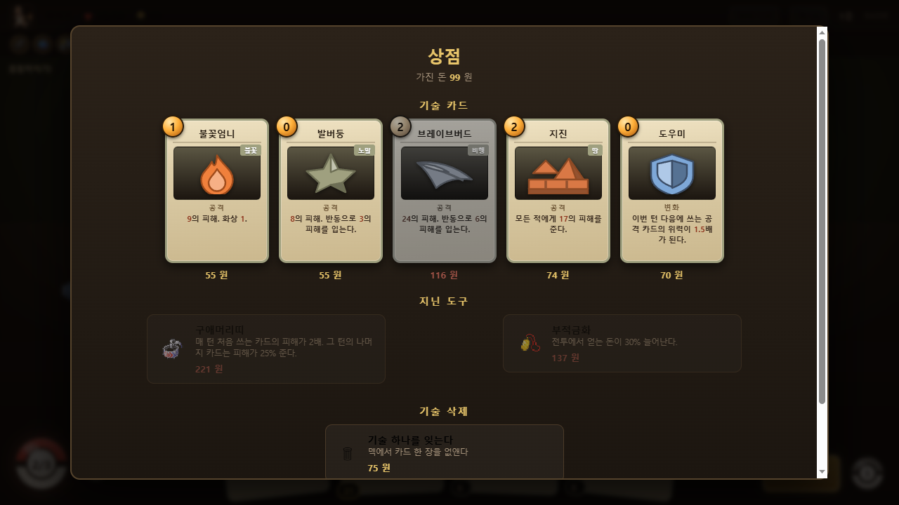
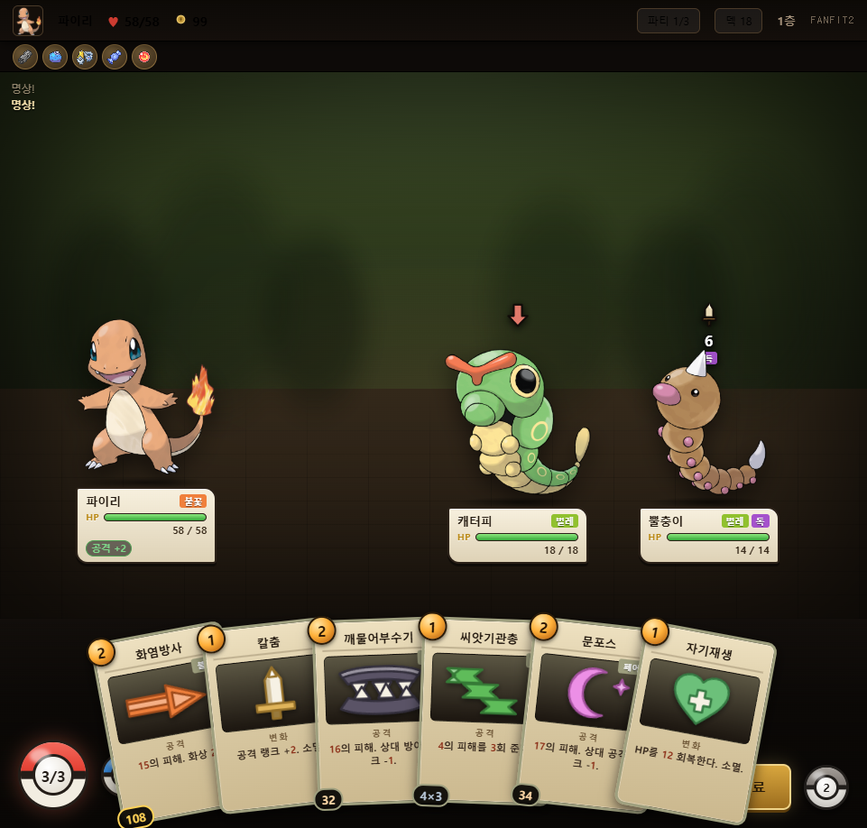
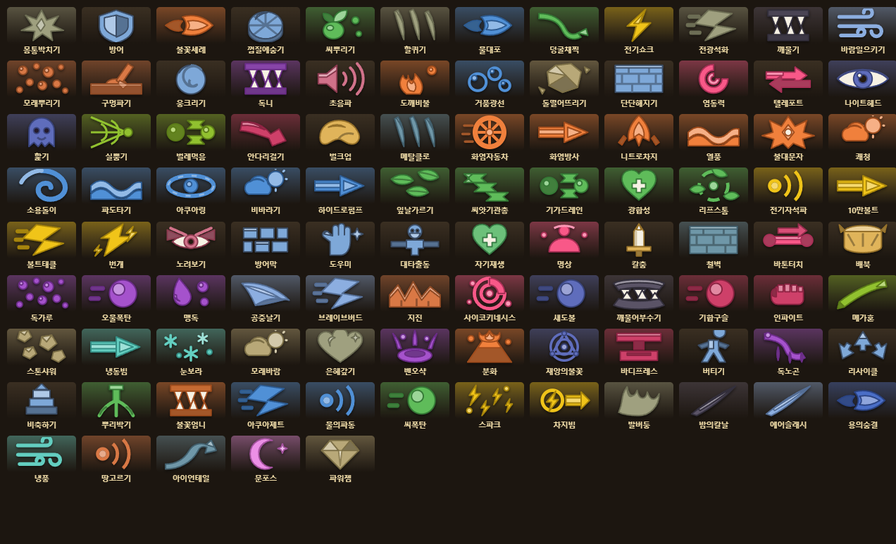

# 포켓스파이어

포켓몬 테마 로그라이크 덱빌더. **슬레이 더 스파이어**의 뼈대에 원작의
**타입 상성**과 **교체**를 얹었다. 순수 HTML + CSS + ES 모듈이라 빌드 과정이 없다.



에너지와 양쪽 더미는 몬스터볼, HP는 원작 배틀 화면처럼 초록→노랑→빨강으로
바뀌는 정보판, 지닌 도구는 실제 아이템 그림이다.
카드의 `21`은 미리보기다 — 불꽃세례(위력 7)가 자속보정 1.5배에 벌레 타입
2배까지 곱해진 **실제 피해**를 카드가 직접 말해 준다.

| | |
|---|---|
|  |  |
|  |  |

포켓몬 그림은 **PokeAPI 공식 아트워크**를 쓴다. 저작물이라 저장소에는 넣지
않고 `py fetch_assets.py` 로 받아 온다(아래 [실행](#실행) 참고). 한 번 받아 두면
게임을 도는 동안 외부 요청은 0건이다.

카드 그림은 **형태를 기술이, 색을 타입이** 정한다.

처음엔 타입별로만 그렸더니 몸통박치기·발버둥·은혜갚기가 전부 같은 노말 별이
됐다. 카드가 104종인데 그림이 18종이니 당연한 일이었다. 그래서 "무엇을 하는
동작인가"로 형태 50종을 그리고(물어뜯기 · 광선 · 던지기 · 베기 · 뿌리 …),
거기에 타입 색을 입힌다.

```
  화염방사 = 광선 + 불꽃색      냉동빔 = 광선 + 얼음색
  몸통박치기 = 충돌            발버둥 = 마구 휘두름      은혜갚기 = 유대
```

같은 계열이라도 색이 다르고 같은 타입이라도 형태가 달라, **104장이 전부 서로
다른 그림**이다(SVG 지문을 전수 비교해 확인했다).





`render/pokemonSprites.js` 의 코드로 찍은 도트 24종은 **대체 그림**으로 남겨 뒀다.
종을 새로 넣었는데 이미지 파일을 아직 안 받아 왔을 때 빈 네모 대신 나온다.

---

## 실행

```bash
py fetch_assets.py    # 그림을 받아 온다 (처음 한 번만)
py serve.py           # http://localhost:5176
```

**그림 자산은 이 저장소에 없다.** 포켓몬·아이템 그림은 닌텐도·게임프리크의
저작물이라 재배포하지 않고, 받아 오는 방법만 담아 뒀다. `fetch_assets.py` 가
PokeAPI 스프라이트 저장소에서 86개(포켓몬 43 + 아이템 43)를 내려받는다.

안 받아도 게임은 돌아간다. 그림 파일이 없으면 로드 실패를 잡아
`render/pokemonSprites.js` 의 코드로 찍은 도트로 갈아 끼운다
(`monImg()`). 지닌 도구도 같다 — `itemImg()` 가 실패를 잡아 이름 첫 글자
배지로 바꿔 끼운다(안 쓰고 `itemUrl()` 을 직접 `` 에 꽂았다가, 배포본
상점의 도구가 전부 깨진 아이콘으로 뜬 적이 있다).

화면에서 포켓몬 그림을 만들 때는 반드시 `monImg()` 를 쓸 것 —
`spriteUrl()` 은 "파일이 있을 것"이라는 약속일 뿐이라, 직접 쓰면 파일이 없을 때
깨진 이미지가 그대로 뜬다.

ES 모듈은 브라우저 보안 규칙상 `file://` 에서 로드되지 않는다.
`index.html` 을 더블클릭하면 빈 화면이 나오므로 반드시 http 로 띄운다.

`py -m http.server` 대신 `serve.py` 를 쓴다. 캐시 헤더를 붙이지 않는 기본
서버로 띄우면 **브라우저가 ES 모듈을 붙들고 옛 코드를 계속 돌린다.** 파일을
고치고 새로고침해도 화면이 그대로라 "왜 안 고쳐지지" 로 시간을 태우게 되는데,
만드는 동안 두 번 당했다 — 한 번은 밸런스 수치를 옛 코드로 재서 결론까지
틀렸다. `serve.py` 는 매 응답에 `no-store` 를 붙여 그 일이 없게 한다.

---

## 이 게임이 슬더스와 다른 점

슬더스의 규칙(에너지 3 / 5장 드로우 / 적 의도 공개 / 갈래진 지도 /
카드 보상 · 유물 · 상점 · 모닥불)은 그대로다. 그 위에 두 개를 얹었다.

> **방어도가 사라지는 시점** — 방어도는 *내 다음 턴이 시작할 때* 사라진다.
> 내 턴이 끝날 때 지우면 적이 때리기도 전에 0이 되어, 방어 카드가 게임
> 내내 아무 일도 하지 않는다. 한동안 실제로 그렇게 돌아갔다(방어도 20에
> 7 피해를 받으면 HP 가 그대로 7 깎였다). 이 한 줄이 밸런스 전체를
> 뒤집으므로 `combat.js` 의 `startPlayerTurn()` 을 건드릴 때 주의할 것.

### 1. 적의 예고에 타입이 붙는다

```
  모래두지 →  [ 땅 · 12 ]      구구를 앞에 세우면 → 0
  롱스톤   →  [ 바위 · 16 ]    꼬마돌을 앞에 세우면 → 8
```

의도에 뜨는 숫자는 **상성·능력랭크·도구까지 전부 반영된 실제 피해**다.
예고와 실제가 어긋나지 않도록 둘 다 같은 함수(`combat/formula.js`)를 통과한다.

### 2. 교체가 에너지 1을 먹는다

파티는 최대 3마리, **선두만 공격을 받는다.** 교체는 턴에 한 번, 에너지 1.

이 값이 게임의 중심 저울이다. 공짜면 매 턴 최적 타입을 세우게 되어 상성이
퍼즐이 아니라 절차가 되고, 원작처럼 턴을 통째로 쓰게 하면 아무도 안 쓴다.
3에너지 중 1이면 **"이번 턴 딜을 3분의 1 포기하고 다음 턴 20 피해를 0으로
만들까"** 라는 계산이 남는다.

벤치 포켓몬에 마우스를 올리면 적의 예고 숫자가 **그 포켓몬 기준으로 다시**
계산돼 바뀐다. 20이 0이 되는 걸 눈으로 보면 교체를 설명할 필요가 없다.

무엇이 어디에 붙는지는 원작을 따랐다.

| | 교체하면 |
|---|---|
| HP · 상태이상 | 포켓몬을 따라간다 (독 걸린 애를 뒤로 뺄 수 있다) |
| 방어도 · 능력 랭크 | 사라진다 (바톤터치만 랭크를 넘긴다) |

### 3. 스타터 셋은 시작부터 다르게 굴러간다

각자 **엮이는 고유 카드 두 장**으로 시작한다 — 한 장이 깔고 한 장이 거둔다.
처음엔 고유 카드가 한 장뿐이었는데, 그러면 셋 다 몸통박치기 5 + 방어 4 +
한 장이라 사실상 같은 덱이었고 파트너를 고른 의미가 첫 판에 하나도 없었다.

| | 고유 카드 | 하는 일 |
|---|---|---|
| **파이리** HP 70 | 불꽃세례 + 불쏘시개 | 화상을 붙이고, 쌓인 화상만큼 세게 때린다 |
| **꼬부기** HP 62 | 껍질에숨기 + 껍질치기 | 방어도를 쌓고, **쌓아 둔 방어도가 그대로 딜**이 된다 |
| **이상해씨** HP 60 | 씨뿌리기 + 흡수 | 독을 얹고, 준 피해만큼 빨아먹으며 시간을 번다 |

껍질치기는 두 번 흔들렸다. 처음엔 "방어도의 **절반**"이었는데, 그러면 굳이
쌓을 이유가 없어서 소개 문구가 거짓말이 됐다. 전부로 바꿔서 "버티는 것이 곧
공격"을 성립시켰다 — 그런데 그 측정은 위의 **방어도 버그 위에서** 한
것이었다. 버그를 고치자 방어도가 막기도 하고 딜도 되는 이중 이득이 되어,
120판에서 꼬부기가 나머지 둘의 두 배 넘게 이겼다. 그래서 값을 붙였다:
방어도 전부를 얹되, 쓰고 나면 절반을 잃는다. 막을 것인가 때릴 것인가를
고르게 된다.

HP가 제각각인 건 **적 구성에 대한 방어 상성**을 되돌리기 위해서다. 자속으로
때릴 때의 평균 배율이 1막에서 꼬부기 1.46 · 파이리 1.21 · 이상해씨 0.91 로
벌어진다(물은 1막의 바위·땅을, 풀/독은 거의 아무것도 못 때린다).

HP만으로는 이 격차가 안 메워져서, 파이리와 이상해씨의 딜을 **타입표를 타지
않는 쪽**으로 옮겼다. 화상과 독은 상성 계산을 거치지 않는 고정 피해라
(`combat/status.js`), 불꽃세례의 화상과 씨뿌리기의 독을 크게 올렸다.
씨뿌리기의 독 5 는 5+4+3+2+1 = 15 를 타입과 무관하게 뽑는다.

### 4. 포켓몬을 잡는 것이 곧 덱빌딩이다

야생 포켓몬 하나를 잡으면 세 가지가 한꺼번에 들어온다.

1. **HP 한 덩이** — 선두가 쓰러져도 이어서 싸운다
2. **방어 타입** — 교체로 흘릴 수 있는 공격이 늘어난다
3. **전용 기술 2장** — 덱에 바로 섞인다 (덱이 두꺼워지는 비용도 같이 온다)

그리고 **카드 보상은 파티가 가진 타입으로 걸러진다.** 무엇을 잡느냐가
앞으로 볼 카드를 정한다.

쓰러진 포켓몬의 **전용 기술은 그 전투 동안 쓸 수 없다.** 선두를 지킬 이유가
여기서 나온다. 전투가 끝나면 HP 1로 일어나고, 포켓몬센터에서 회복한다.

### 5. 능력 랭크는 원작 공식 그대로

`+n → (2+n)/2`, `−n → 2/(2+n)`. +1 이 1.5배, +2 가 2배, −1 이 0.67배.
공격 랭크는 곱하고 방어 랭크는 나눈다. 최대 ±6.

### 6. 화면이 포켓몬처럼 말하게

**배틀 정보판** — 이름·타입·HP 를 원작 배틀 화면처럼 크림색 판 하나에 담았다.
HP 는 남은 비율에 따라 **초록 → 노랑 → 빨강**으로 바뀐다. 숫자를 읽기 전에
색으로 먼저 상황이 들어오는 게 그 화면의 핵심이라, 이 한 줄이 "포켓몬답다" 에
제일 크게 기여한다.

**몬스터볼** — 에너지 구슬과 양쪽 더미를 전부 몬스터볼로 바꿨다. 화면에서 제일
먼저 눈이 가는 세 덩어리라 여기만 바뀌어도 인상이 달라진다. 숫자는 가운데
버튼 안에 넣었다(띠 위에 얹으면 아무것도 안 읽힌다).

**지닌 도구** — PokeAPI 아이템 스프라이트(30×30 도트)를 그대로 쓴다. 배지가
26px 라 원본 크기대로 붙어 흐려지지 않는다. 목탄·오랭열매·집중렌즈처럼
원작에 실재하는 도구라 이름만 봐도 무슨 효과인지 짐작이 간다.

> 카드 그림칸(104×60)에는 아이템 도트를 쓰지 않았다. 30px 를 세 배로 늘리면
> 매끄러운 포켓몬 일러스트 옆에서 혼자 뭉개진다. TM 디스크 스프라이트도
> 있지만 전부 같은 원반에 색만 달라서, 형태가 제각각인 지금의 벡터 엠블럼보다
> 알아보기 어렵다. 그래서 카드는 벡터 엠블럼을 유지했다.

### 7. 손에서 대상까지 눈이 따라가게

카드를 누르면 그 카드가 **대상 쪽으로 날아가고**, 공격이면 선두가 앞으로
찌르고, 맞는 자리에 **타입 색 파동**이 터진 뒤 피해 숫자가 뜬다. 규칙 적용을
150ms 늦춰 카드가 날아가는 동안 숫자가 나오게 맞췄다 — 눌렀는데 반대편에서
숫자만 튀어나오면 그 둘이 같은 사건으로 안 읽힌다.

연출이 도는 동안에는 다음 입력을 막는다. 안 그러면 한 턴에 카드를 두 장 낼
수 있고, 그게 화면과 상태가 어긋나는 가장 빠른 길이다.

새로 뽑은 카드만 아래에서 차례로 올라오고(직전 손패에 없던 것만), 더미 숫자가
바뀌면 톡 튄다. 카드가 어디로 갔는지 눈이 따라가라는 것이다.

**뽑을 카드 / 버린 카드** 더미는 눌러서 내용을 볼 수 있다. 뽑을 더미는
비용·이름 순으로만 보여 준다 — 무엇이 남았는지는 세어 볼 수 있어야 하지만,
다음 다섯 장을 그대로 보여 주면 덱빌딩의 긴장이 통째로 사라진다.

### 8. 상태이상은 전부 결정적이다

원작의 확률 판정(혼란·잠듦)은 뺐다. 카드 게임에서는 "이유 없이 계획이
무너진 느낌"만 남기기 때문이다. 얼마나 아플지 미리 셀 수 있게 바꿨다.

| | |
|---|---|
| **독** | 턴 끝에 스택만큼 피해, 스택 −1 |
| **화상** | 턴 끝에 스택만큼 피해, 스택 절반. 공격력 −25% |
| **마비** | 에너지 −1 (적은 공격력 −25%), 턴마다 −1 |
| **얼음** | 그 턴 통째로 행동 불가 |

---

## 현재 상태

**3막까지 이어서 플레이 가능.** 보스를 잡으면 바로 다음 막으로 넘어간다.

| 막 | 이름 | 층 | 보스 |
|---|---|---|---|
| 1 | 상록의 숲 | 15 | 스피어 |
| 2 | 달의 신전 | 16 | 팬텀 |
| 3 | 첨탑 | 17 | 뮤츠 |

막을 넘길 때 파티 전원 최대 HP +12 · 완전 회복 · 돈 +120 을 받고, 지도가
새로 깔린다. 막마다 만나는 적도 **잡을 수 있는 종도** 다르다 — 3막에서는
스라크 · 쁘사이저 · 에레브 · 마그마 · 루주라를 만난다.

- 포켓몬 **43종** (파티 편성 가능 21종 / 적 35종, 일부 겹침)
- 기술 카드 **125종** (보상 풀 92종), 지닌 도구 20종, ? 방 7종
- 방: 전투 · 엘리트 · ? · 상점 · 포켓몬센터 · 보물 · 보스
- **저장·이어하기** — 전투 중에 탭을 닫아도 그 자리에서 이어진다
- **같이 하기** — 방 코드로 최대 3인 협동
- 강화는 **바뀌는 부분을 나란히 보여 주고** 고르게 한다 — 이름 옆에 `+` 만
  붙여 놓으면 무엇이 얼마나 좋아지는지 알 수 없어, 고를 근거가 화면에 없었다
- 모바일 가로 화면 지원 (`ui/stage.js`)

진화, 물약, 저장은 아직 없다.

### 난이도

막이 올라갈수록 세지되, **막 안에서도** 세진다. 층 진행도가 그대로 배율에
얹힌다 (`data/acts.js` 의 `hpRamp` · `dmgRamp`).

```
실효 배율 = hpMul * (1 + hpRamp * 진행도)      진행도 = 밟은 층 / 총 층
```

막마다 배율 하나만 뒀을 때는 어떤 값을 넣어도 한쪽이 망가졌다. 1막 첫 층의
플레이어는 포켓몬 한 마리에 카드 열 장이라 조금만 세게 하면 그냥 죽고, 같은
막 마지막 층에서는 카드가 스무 장이라 뭘 만나도 한 턴에 쓸어버린다. 배율을
1.25로만 올려도 1막 보스에서 24판 중 16판이 끝나면서 2·3막은 여전히
심심했다. 램프를 넣고서야 세 막이 고르게 어려워졌다.

보스만 램프를 안 받는다 — 어차피 막 꼭대기에만 있어서 진행도가 늘 1이라,
램프까지 곱하면 수치가 두 번 올라 벽이 된다.

### 밸런스 근거

`tools/balance.js` 가 화면 없이 규칙만 돌린다. 3막 전체를 **시드 40 ×
스타터 3 = 120판** 돌려 맞췄다.

```js
const B = await import('./tools/balance.js');
await B.measure(40);        // 승률 · 방마다 깎이는 HP · 죽는 자리
await B.encounterTable();   // 배율까지 반영한 적 수치표
```

| | 봇 클리어율 |
|---|---|
| 전체 | **9/90 (10%)** |
| 파이리 | 1/30 |
| 꼬부기 | 7/30 |
| 이상해씨 | 1/30 |

방마다 깎이는 HP(파티 최대 HP 대비)와 걸리는 턴:

| | 잡몹 | 엘리트 | 보스 |
|---|---|---|---|
| 1막 | 9% / 3.3턴 | 29% / 4.4턴 | 31% / 4.2턴 |
| 2막 | 11% / 4.4턴 | 30% / 6.8턴 | 38% / 9.7턴 |
| 3막 | 14% / 5.3턴 | 29% / 12.2턴 | 41% / 18.3턴 |

죽는 자리가 아홉 종류 방에 고르게 흩어져 있다(3~16판씩) — 한 군데가 벽이
아니라는 뜻이다.

**이 봇은 사람보다 못 둔다.** 카드 순서를 안 짜고, 교체도 "다음 턴에 아플
것 같으면" 만 본다. 그래서 10% 는 사람 승률의 아래쪽 경계로 읽어야 한다.

> "아직 너무 쉽다"는 말을 듣고 한 번 더 올렸다(봇 38% → 14%). 그때도 1막만
> 올리면 첫 층에서 절반이 죽고 2·3막은 그대로 심심했다 — 그래서 1막은 거의
> 그대로 두고 2·3막을 크게 올렸다. 지금은 죽는 자리가 아홉 종류 방에 3~13판씩
> 고르게 흩어져 있다.

> 봇이 상점을 안 쓰고 보상은 첫 장만 집던 시절의 측정으로 맞췄더니, 실제로
> 돌려 보면 훨씬 쉬웠다. 사람은 3막쯤이면 상점에서 카드 예닐곱 장과 도구
> 서넛을 사 들고 온다. 지금 봇은 돈을 쓰고, 보상 세 장 중 등급·자속을 보고
> 고르고, 모닥불에서 멀쩡하면 강화를 택한다.

> ⚠️ **재는 방법**: 브라우저가 ES 모듈을 캐시한다. 수치를 고친 뒤 그냥
> 재면 **옛 코드로 잰 값**이 나온다(실제로 한 번 헛다리를 짚었다).
> `serve.py` 가 `no-store` 를 보내므로 **새로고침을 먼저** 하고 재면 된다.
> 최상위 모듈에만 `?v=` 를 붙이는 건 소용없다 — 그 모듈이 import 하는
> 파일들은 캐시된 옛 버전이 그대로 붙는다.

---

## 날씨·지속 효과

비바라기·쾌청·모래바람 같은 지속 카드는 **겹쳐 쓰면 겹쳐 쌓인다**
(비바라기 두 장 = 물 기술 위력 +8). 전투가 끝나면 사라진다.

> "비바라기를 열 번 넘게 썼는데 한 번 쓴 거랑 차이가 없다"는 말을 들었다.
> 재 보니 규칙은 멀쩡했다 — 한 전투 안에서 4 → 8 → 12 로 쌓이고 물대포
> 피해도 54 → 78 → 102 로 따라 올랐다. 문제는 **그게 화면 어디에도 안 보였다는
> 것**이다. 지금 몇이 깔려 있는지 알 방법이 없으니, 여러 판에 걸쳐 한 장씩
> 쓴 사람 눈에는 아무 일도 안 일어난 것과 같았다.
>
> 그래서 아레나 위에 지금 깔린 것을 값과 함께 띄운다(`쾌청+4` `비바라기+8`).
> 카드 문구도 "전투가 끝날 때까지" 에서 "이 전투 동안 … 겹쳐 쓰면 그만큼 더
> 쌓인다" 로 바꿨다.

---

## 저장·이어하기

카드를 낼 때마다 브라우저에 적어 둔다. 타이틀에 "이어서 한다"가 뜨고,
전투 중이었으면 손패·에너지·적 HP까지 그대로 이어 붙는다.

되살린 판이 이후에 굴리는 난수까지 정확히 같은지 확인해 뒀다 — 이게
어긋나면 "저장 지점 직전으로 돌아가 보상을 다시 굴린다"가 가능해진다.
`mulberry32` 의 상태가 정수 하나뿐이라 그 값만 적으면 된다.

> ★ 보스를 잡고 **막 클리어 화면에서** 닫으면 한 번 막힌 적이 있다.
> 저장이 `advanceAct()` 전에 찍혀서, 이어했을 때 이미 잡은 보스 방에
> 서 있게 되어 갈 수 있는 방이 하나도 없었다. 상태를 바꾼 **직후에**
> 다시 적는 것으로 고쳤다.

---

## 같이 하기 (최대 3인 협동)

방 코드 네 글자로 모인다. 서버는 없다 — WebRTC(PeerJS)로 브라우저끼리
직접 잇는다. 혼자 할 때는 이 코드가 아예 안 불러와지므로 외부 요청은
여전히 0건이다.

### 무엇이 달라지는가

파티 세 칸을 사람이 하나씩 맡는다. 각자 자기 스타터로 시작해 **자기 덱**을
짜고, 한 라운드는 `1P 턴 → 2P 턴 → 3P 턴 → 적 턴` 으로 돈다.

그래서 "선두"가 **누가 앞에서 맞을 것인가**라는 협동 판단이 된다. 방어도는
자리(선두)에 붙으므로 뒤에 있는 사람이 방어 카드로 앞사람을 막아 줄 수 있다.
방어도가 사라지는 것도, 도트 피해도, 교체 1회 제한도 전부 **라운드** 단위다 —
좌석마다 걸면 3인이 한 라운드에 방어도를 세 번 지우게 된다.

돈과 도구는 팀 것, 카드 보상은 각자 자기 세 장에서 고른다.
지도·상점·? 방은 방장이 고른다.

### 난이도

| | 적 HP | 적 피해 | 봇 클리어율 |
|---|---|---|---|
| 혼자 | ×1 | ×1 | 10% |
| 2인 | ×2.35 | ×1.64 | 7~13% |
| 3인 | ×3.75 | ×2.15 | 13% |

처음엔 HP ×3.35 · 피해 ×1.95 로 뒀다가 3인 승률이 53% 로 **혼자보다 쉽게**
나왔다. 셋이 방어 카드를 한 사람에게 겹쳐 쌓을 수 있어서다. 반대로 피해를
×3.1 까지 올렸더니 1막에서만 절반이 죽었다 — 1막 첫 층은 각자 카드 열
장짜리 덱이라 인원수가 늘어도 별로 안 세지기 때문이다. HP 를 크게, 피해는
덜 올리는 쪽으로 갈랐다.

### 어떻게 맞추는가 (락스텝)

상태를 통째로 보내는 방식도 생각했는데, 그러려면 화면 코드가 "살아 있는
엔진" 대신 "받은 그림"을 그리도록 통째로 갈아엎어야 했다. 카드 미리보기와
적 의도 미리보기가 전부 엔진 함수를 부르기 때문이다.

그래서 반대로 갔다. **모두가 같은 엔진을 돌리고, 오가는 건 행동뿐이다.**

```
손님: "카드 7번을 3번 적에게"  →  방장
방장: 순번을 붙여              →  전원 (자기 포함)
전원: 받은 순서대로 그대로 적용
```

이 엔진은 난수가 시드 스트림 하나뿐이고 `Math.random` 도 `Date` 도 안 쓴다.
같은 시드 + 같은 행동 순서 = 같은 결과다. 덕분에 화면 코드를 **한 줄도 안
고치고** 멀티가 됐다. 2인으로 한 전투를 끝까지 돌려 양쪽의 HP·덱·돈·시드와
행동 45개가 전부 일치하는 것을 확인했다.

만드는 중에 두 번 갈렸고, 둘 다 같은 종류의 실수였다:

- **좌석 잠금을 규칙 안에 넣었다.** "내가 못 낸다"와 "이 카드는 낼 수 없다"가
  한 덩어리가 되어, 방장이 확정해 보낸 남의 카드까지 막혔다(방어도 5 대 0).
  좌석 잠금은 화면이 묻는 질문일 뿐이고, 확정된 행동을 적용할 때는 안 본다.
- **돈을 각자 눌러서 받게 뒀다.** 한 사람만 누르면 그 사람만 돈이 늘어
  갈렸다(110 대 99). 팀 몫은 자동으로 넣는다.

> ⚠️ 공개 시그널링 서버(PeerJS)를 쓴다. 가끔 안 붙는데 대개 방을 다시 만들면
> 풀린다. 안정성이 필요해지면 `net/peer.js` 만 갈아 끼우면 된다 —
> 위층은 `send` / `onData` 만 알고 있다.

---

## 구조

로직과 화면을 나눠 뒀다. 나중에 3D나 다른 엔진으로 옮길 때를 위해서다.

```
src/
  core/     rng(시드 스트림) · run(런 진행) · ko(한국어 조사)
            save(저장·이어하기)
  data/     types(상성표) · pokemon · cards · relics · enemies · events
            mapGen · acts(막 구성과 난이도 곡선)
  combat/   formula(피해 계산) · status · combat(전투 엔진)
  render/   pokemonSprites(24종 + 도트 대체) · cardEmblem(벡터 엠블럼)
            itemArt(지닌 도구) · pixelSprite · shading
  net/      peer(WebRTC 연결) · session(로비 + 락스텝)
  ui/       dom · cardView · combatView · mapView · overlays · icons · tooltip
            stage(작은 화면에서 판을 통째로 축소) · lobbyView
tools/      balance(헤드리스 밸런스 측정기 — 게임에는 안 실린다)
  assets/   pokemon/ · items/  ← 저장소에 없음. fetch_assets.py 로 받는다
```

- **같은 시드는 같은 판을 낸다.** 맵·보상·상점·이벤트·전투가 각각 독립된
  난수 스트림을 쓰므로, 전투 굴림이 하나 늘어도 맵은 그대로다.
- 콘솔에 `__game.run` / `__game.combat` 이 열려 있다.

---

## IP — 공개 배포 전에 반드시 읽을 것

`fetch_assets.py` 가 받아 오는 그림은 **닌텐도·게임프리크의 공식 아트워크**다.
그래서 저장소에는 넣지 않고(`.gitignore`) 받아 오는 방법만 담아 뒀다.
개인적으로 돌려보는 프로토타입이라 쓰는 것이고,
**공개 배포하거나 수익화하면 곧바로 저작권 문제가 된다.**

> README 의 스크린샷에는 그 그림이 그대로 보인다. 만든 것을 보여 주는 용도라
> 남겨 뒀지만, 배포 계획이 생기면 이것도 같이 갈아야 한다.

바꿔야 할 곳은 네 군데뿐이다. 나머지 코드는 손댈 필요가 없다.

| | |
|---|---|
| `fetch_assets.py` + `src/assets/` | 그림 — 오리지널로 교체 |
| `src/data/pokemon.js` | 종 이름·타입·색 |
| `src/data/enemies.js` | 적 이름·기술 이름 |
| `src/data/cards.js` | 기술 이름 |
| `docs/*.png` | README 스크린샷 |

규칙 자체(18타입 상성표, 능력 랭크 공식)는 아이디어이지 표현이 아니므로
그대로 두어도 된다. `render/pokemonSprites.js` 의 도트도 원본을 옮긴 것이
아니라 특징만 살려 새로 찍은 것이지만, 형상이 원작을 참조하므로 같이 손보는
편이 안전하다.
